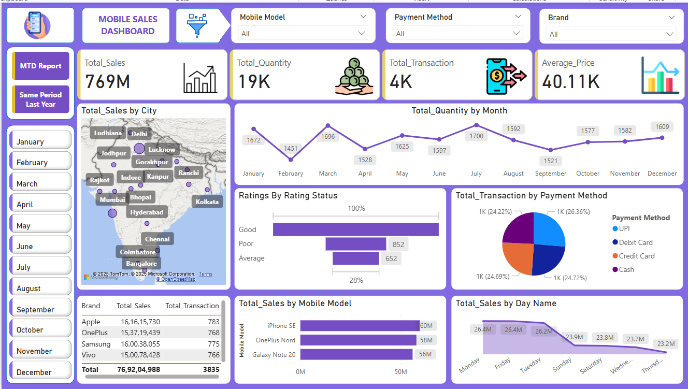
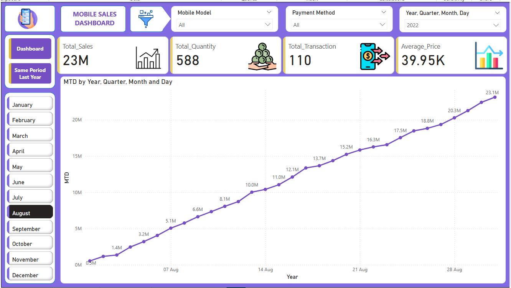
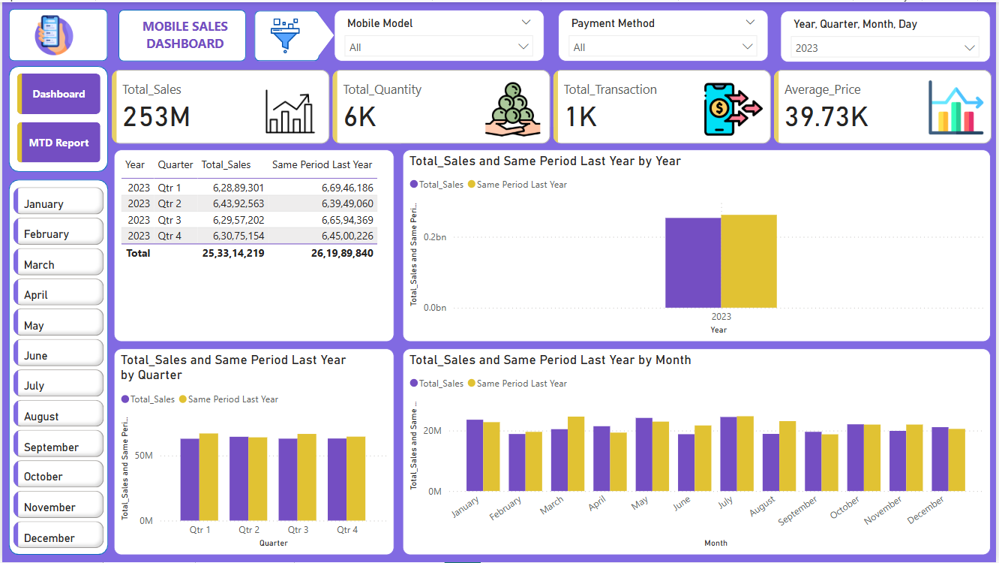

# 📊 Mobile Sales Dashboard - Power BI Project

## 📝 Problem Statement
Mobile sales businesses often handle large volumes of transactions across regions and devices. However, drawing actionable insights from this raw data can be challenging. This dashboard was built to analyze sales data, customer behavior, and business performance effectively in a visual and intuitive manner.

## 🧾 Dataset Description
The dataset used in this project includes the following columns:
- Transaction ID
- Day, Month, Year
- Day Name
- Brand
- Units Sold
- Price Per Unit
- Customer Name
- Customer Age
- City
- Payment Method
- Customer Ratings
- Mobile Model

### 🧹 Data Cleaning & Preparation
- Cleaned missing or inconsistent entries.
- Grouped Day, Month, and Year into a unified date hierarchy.
- Created a **custom Date Calendar** using DAX formulas.
- Performed **data modeling** by connecting `Sales[Date]` to `Calendar[Date]` for enhanced time-based insights.

## 📌 Key Performance Indicators (KPIs)
- **Total Sales**
- **Total Quantity Sold**
- **Number of Transactions**
- **Average Price per Unit**

---

## 📄 Dashboard Pages Overview

### 📍 Page 1: **Main Dashboard**

**Highlights:**
- Total Sales: ₹769M
- Quantity Sold: 19K | Transactions: 4K
- Average Price: ₹40.11K
- Sales by City (Map View)
- Ratings Analysis
- Sales by Mobile Model & Day Name
- Transactions by Payment Method

**Insights:**
- Highest sales came from Apple and Samsung.
- Majority of users gave good ratings.
- Most transactions were through Debit/Credit Cards.

---

### 📍 Page 2: **MTD (Month-to-Date) Report**

**Highlights:**
- Sales tracked daily across August 2022.
- Steady and linear growth pattern in MTD sales.
- Clear day-wise contribution towards overall monthly performance.

**Insights:**
- August saw a strong progressive growth, indicating successful campaigns or seasonality.

---

### 📍 Page 3: **Same Period Last Year Comparison**

**Highlights:**
- Comparative view of sales in 2023 vs. 2022.
- Quarterly and monthly breakdown of total sales.

**Insights:**
- Q1 and Q3 of 2023 underperformed compared to 2022.
- Strategic focus required for improving Q1 sales.

---

## 📈 Analysis & Insights
- **Brand Performance:** Apple leads slightly ahead of Samsung and OnePlus.
- **Customer Preferences:** Peak activity on Mondays and Fridays.
- **Geographic Insights:** Major sales hubs include Delhi, Mumbai, Hyderabad, and Bangalore.
- **Customer Behavior:** Ratings indicate high satisfaction; few poor experiences reported.

---

## ✅ Conclusion
This Power BI dashboard enables data-driven decision-making for mobile sales. By integrating cleaned and modeled data, time intelligence, and detailed KPIs, businesses can:
- Track sales trends by time, city, and model.
- Identify top-performing brands and customer segments.
- Compare YoY performance and optimize future strategies.

---
